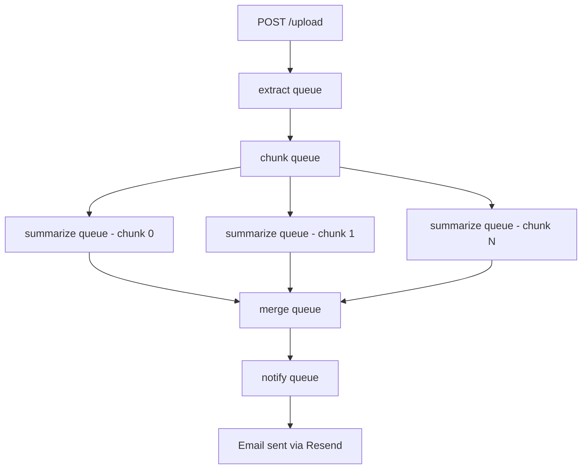

# doc-pipeline

An asynchronous document processing pipeline that ingests PDFs, summarizes them using a distributed job queue, and emails the result — built to demonstrate backend infrastructure patterns: job queues, fan-out/fan-in parallelism, retry logic, stateful pipeline orchestration, and authenticated, per-user access control.

**Live Demo:** [Document Processing Pipeline](https://doc-pipeline-production-a032.up.railway.app)

**Demo video:** 

https://github.com/user-attachments/assets/3a7b92e1-4acb-41ba-a374-2ef3f82d80a6

---

## What it does

A user registers for an account, logs in to receive a JWT, then uploads a PDF using that token. The system:

1. Extracts raw text from the PDF
2. Splits the text into chunks
3. Summarizes each chunk **in parallel** using OpenAI
4. Merges all chunk summaries into one coherent final summary
5. Emails the final summary to the user

All of this happens asynchronously — the upload request returns immediately, and a `GET /status/:documentId` endpoint lets the client poll progress at any time. Every document is tied to the account that uploaded it; only that account can view its status.

This exists because a synchronous request/response cycle can't reasonably handle a multi-minute, multi-step, externally-dependent workflow like this. A job queue lets each stage run independently, retry on failure, and scale separately from the others.

## Architecture



Each stage is a **separate BullMQ queue** with its own dedicated worker. Postgres tracks the state of every document and every individual job; Redis holds the queues themselves.

### Authentication and ownership

`/upload` and `/status/:documentId` both require a valid JWT, obtained via `/register` and `/login`. Passwords are hashed with bcrypt before storage — never stored or logged in plain text — and login returns the same generic "Invalid credentials" error whether the email doesn't exist or the password is wrong, avoiding confirming to an attacker which emails are registered.

Every document is tied to its owner via `documents.user_id`, a foreign key into `users.id`. The status route enforces ownership directly in its query (`WHERE id = $1 AND user_id = $2`), so a user requesting another account's document simply gets a 404 — the same response as if the document didn't exist at all, rather than a 403 that would confirm it exists but belongs to someone else.

Identity is only ever taken from the verified JWT (`req.userId`, set by the `requireAuth` middleware), never from request body fields a client could freely type in — this was a deliberate change from an earlier version of the project where the upload route accepted a free-text `email` field with no verification behind it at all.

### Why separate queues per job type

Early in development, all five workers listened on a single shared queue and filtered jobs by name inside each worker (`if (job.name !== 'extract') return`). This created a real, hard-to-spot bug: BullMQ workers sharing one queue name become **competing consumers** — any job can be picked up by any worker instance, regardless of whether that worker is built to handle it. A job named `"extract"` could just as easily be grabbed by the `summarize` worker, whose guard clause would silently `return` without doing any work, and BullMQ would still mark the job `completed`.

This was diagnosed by inspecting raw job data directly in Redis (`redis-cli HGETALL bull:pipeline:<id>`) and noticing jobs were "completing" in a few milliseconds with a `null` return value — far too fast for the real work they claimed to have done. The fix: **one dedicated queue per job type**, so a job physically cannot be seen by the wrong worker. No more randomness, no wasted retries, no misleading job history.

### Fan-out / fan-in

The `chunk` worker splits a document into N pieces and enqueues N independent `summarize` jobs — this is the **fan-out**: parallel work, so a five-chunk document summarizes roughly as fast as a one-chunk document, not five times slower.

The tricky part is the **fan-in**: only one `merge` job should ever run per document, triggered exactly once, after the *last* chunk finishes — not the *chunk with the highest index*, since chunks finish in unpredictable order due to network timing. Each `summarize` job, after saving its own result, counts how many summaries exist for that document and compares it against the document's known total chunk count. Whichever job's insert makes the count match is the one that enqueues `merge`.

**Known limitation:** this count-then-compare check has a theoretical race condition — two summarize jobs finishing at nearly the same instant could both observe the same count and both trigger `merge`. At this project's scale that risk is low and hasn't been observed, but a fully correct production implementation would use a database transaction lock or an atomic counter instead.

### Retry strategy

Every job gets up to 3 attempts with exponential backoff (2s → 4s → 8s), configured once in a single `addJob` function that every part of the app funnels through. This matters most for the `summarize` stage, which depends on an external API — retrying immediately after a rate limit would just get rate limited again; backing off gives OpenAI room to recover.

## Tech stack

- **TypeScript / Node.js / Express** — API layer
- **BullMQ + Redis** — job queue and worker orchestration
- **PostgreSQL** — persistent state for users, documents, jobs, and summaries
- **bcrypt + jsonwebtoken** — password hashing and JWT-based authentication
- **Docker Compose** — local development environment
- **OpenAI API** — chunk summarization and final synthesis
- **Resend** — transactional email delivery
- **Vitest** — testing
- **GitHub Actions** — CI, running tests against real Postgres/Redis service containers
- **Railway** — deployment

## Database schema

Four tables, deliberately kept simple:

- **`users`** — one row per account: email (unique), bcrypt password hash
- **`documents`** — one row per upload: filename, owning `user_id`, overall status, total chunk count
- **`jobs`** — one row per unit of work across every stage (extract, chunk, summarize×N, merge, notify), with its own status, attempt count, and error message
- **`summaries`** — one row per chunk summary (`chunk_index` = 0, 1, 2...), plus one final row per document where `chunk_index IS NULL` marking the merged result

Splitting `documents.status` from individual `jobs.status` was a deliberate choice: a document's content can be fully processed (`status = 'done'`) even if the final email fails to send — those are genuinely separate concerns, and conflating them would make a successful summary look "failed" just because delivery hiccuped.

## API

**`POST /register`** — create an account with `email` and `password`. Password is hashed before storage.

**`POST /login`** — returns a JWT on valid credentials.

**`POST /upload`** — requires `Authorization: Bearer <token>`. Multipart form with a `file` (PDF). Returns the created document record immediately, owned by the authenticated user; processing continues in the background.

**`GET /status/:documentId`** — requires `Authorization: Bearer <token>`. Returns the document's current status plus every job associated with it, scoped to documents owned by the authenticated user.

**`GET /health`** — basic liveness check, unauthenticated.

## Running locally

```bash
git clone https://github.com/Amon-10/doc-pipeline.git
cd doc-pipeline
cp .env.example .env   # fill in OPENAI_API_KEY, RESEND_API_KEY, and JWT_SECRET
docker compose up -d --build
```

Requires Docker. The app runs on `http://localhost:3000`.

## Testing

```bash
npm test
```

Current coverage is a unit test suite for the text-chunking logic (sentence-boundary-aware splitting, edge cases like empty input). Integration tests covering the workers' database behavior against a dedicated test database are a known gap — deferred to prioritize finishing and deploying the full pipeline first, and planned as a follow-up.

## Deployment notes

Deployed on Railway: app service + managed Postgres + managed Redis. A few things came up during deployment worth noting:

- **Migrations don't run automatically on a managed Postgres instance** the way they do locally via Docker's `docker-entrypoint-initdb.d` mount. They were applied manually, once per migration, via `railway connect` (which tunnels directly into the database) and psql's `\i` command to run each numbered migration file in order.
- **Railway blocks outbound SMTP entirely on non-Pro plans** to prevent spam abuse — this affected email delivery specifically, not the rest of the pipeline. The fix was switching from SMTP (nodemailer) to Resend's HTTPS-based email API, which isn't subject to that restriction. As a side effect of using Resend's shared testing domain (rather than a verified custom domain), delivery is currently limited to the account's own verified address — the pipeline itself works end to end regardless, as shown in the demo video.

## What I'd add next

- Integration tests against a dedicated test database
- A verified sending domain to lift the email delivery restriction
- A transaction lock or atomic counter to fully close the fan-in race condition
- Deleting uploaded PDFs from disk after extraction, or moving storage to S3/R2 rather than local disk
- Rate limiting on `/upload` and per-worker OpenAI call limits, to protect against abuse and control API cost on a publicly reachable endpoint
- A global Express error-handling middleware — malformed requests currently surface Node's default HTML stack trace instead of a clean JSON error response